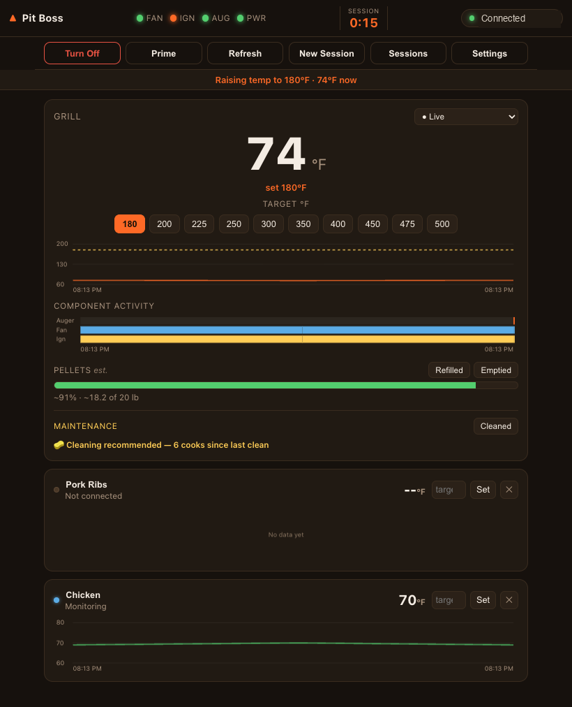
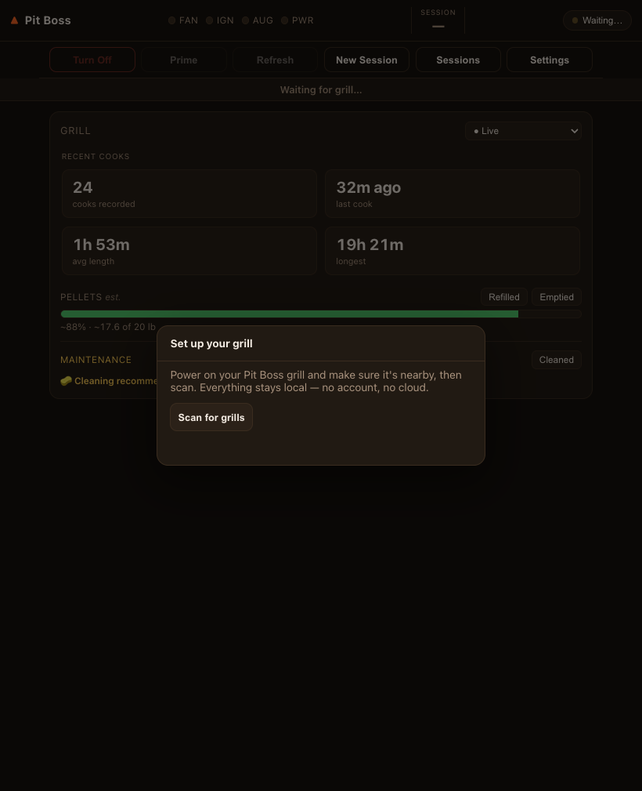

# openkb-pit-boss

A local **Bluetooth** controller for Pit Boss pellet grills — the controls you
actually paid for, with none of the cloud. No Dansons account, no telemetry, no
marketing. It talks straight to the grill's Mongoose-OS / PBL control board over
BLE and adds the things the stock app never did: full cook recording, a graceful
fire-preventing shutdown, tunable anomaly alerts, and an at-a-glance dashboard.

**Status: production-ready**, deployed in-platform and validated on real fire.
Works with **any Bluetooth Pit Boss grill** — a first-run wizard scans, finds your
grill, and picks the model (via `pytboss`'s 100+ supported models; see
[ADR 0003](docs/adr/0003-grill-discovery-and-model-selection.md)). Developed and
validated against a **Pit Boss Pro Series 1100 Combo** (`PB1100PSC3`, PBL control
board, firmware 0.5.7).



*A live cook, warming up: grill temp and setpoint, the auger/fan/igniter timeline,
per-probe monitoring, pellet estimate, and maintenance — everything the stock app
hides, on one screen. (Between cooks it shows a [recent-cook dashboard](docs/screenshots/dashboard.png) instead of empty placeholders.)*

## What it does

- **Live control** — set grill temp (from the board's real preset ladder), probe
  targets, lights, prime, and on/off, all over local BLE.
- **Full cook recording** — every reading written to the cook: grill + setpoint,
  each probe, and the auger/fan/igniter as they fire. Per-source charts, replayable.
- **Session manager** — rename, multi-select, and bulk-delete recorded cooks
  (with a one-tap "select likely test cooks"); the active cook is protected.
- **Graceful shutdown** — cool-to-200° → off → fan cool-down, enforced. This is the
  fire-prevention step whose absence, in the stock flow, let a fire climb the auger
  tube and seize the motor on this very grill (see the ADRs).
- **Anomaly detection** — lid-open, out-of-pellets, over-temp, and grease-fire
  flare-up, each a tunable rule with native notifications.
- **Pellet estimate & maintenance** — hopper level from auger run-time; cleaning
  reminders by cooks / run-hours / flare-ups.
- **At-a-glance dashboard** — a ticking session clock, recent-cook stats, and the
  last-known pellet level, shown even before the grill connects.
- **Lives in the OS** — tray-first, start-at-login, rich native notifications.
- **100% local** — no cloud, no account, no telemetry.

## Why not the official app?

The stock Pit Boss / Dansons app needs an account and their cloud to run a grill in
your own backyard, shows a single temperature while hiding the machine, keeps no
cook history you can replay, and never enforced a cool-down. This does more with the
exact same hardware, entirely on your own machine. Full point-for-point comparison
and the build story: **[`docs/session-review.html`](docs/session-review.html)**.

## Architecture

```
┌─────────────────┐   JSON over stdio   ┌──────────────────┐   BLE    ┌────────┐
│ Electron (TS)   │ ◄─────────────────► │ Python sidecar   │ ◄──────► │ Grill  │
│ main + renderer │                     │ (pytboss/bleak)  │          │  PBL   │
└─────────────────┘                     └──────────────────┘          └────────┘
```

- **Python sidecar** (`python/sidecar.py`) owns the BLE connection via
  [`pytboss`](https://github.com/dknowles2/pytboss) — proven, board-correct
  decoding. Speaks line-delimited JSON on stdin/stdout.
- **Electron main** (`src/main/`) spawns the sidecar, bridges IPC, owns the cook
  recorder + safety engines, and writes a unified, tailable log to
  `/tmp/openkb-pit-boss.log`.
- **Renderer** (`src/renderer/`) is the control UI.

Why a Python sidecar instead of pure JS? `pytboss` already implements the BLE
framing and the per-control-board temperature/status decoding for 100+ models.
Reusing it is far more reliable than re-deriving byte offsets in Node.

## Setup

**Prerequisites:** Node 20+ and Python 3.11+ (macOS: `brew install node python`).

```bash
git clone git@github.com:travisdetert/openkb-pitboss-controller.git
cd openkb-pitboss-controller
npm run setup      # one command: JS deps + Python venv + pinned BLE stack
npm start          # builds, launches, and opens the first-run wizard
```

`npm run setup` (`scripts/setup.mjs`) runs `npm install`, creates the `.venv`, and
installs the pinned deps from `requirements.txt`. It's idempotent — re-run it
anytime. Other scripts: `npm test` (unit suite), `npm run dev` (devtools open).

macOS will prompt for **Bluetooth permission** the first time it scans — allow it
(System Settings → Privacy & Security → Bluetooth).

**First run:** with no grill configured yet, the app opens a **setup wizard** —
power on your grill, tap *Scan*, pick it from the list, and choose your model
(pre-filtered to your control board). The choice is saved locally; later launches
connect straight to your grill. Change it anytime via **Settings → Change grill**.



## Diagnostics (no app needed)

```bash
. .venv/bin/activate
python python/scan.py            # find grills advertising the Mongoose RPC service
python python/probe.py <addr>    # dump a device's GATT services
python python/livetest.py PBL-   # connect by name, print live state (read-only)
python python/test_sidecar.py    # drive the sidecar end-to-end (read-only)
```

## Protocol notes

- The grill advertises as `PBL-<MAC>`; `PBL` is also its pytboss control board.
- **macOS rotates BLE peripheral UUIDs**, so we always match the grill by its
  stable advertised *name*, never by a cached address.
- Control flows through one MCU command (`PB.SendMCUCommand`) carrying simple
  `FE…FF` hex frames — fully local, no account.
- BLE range is short (small stock antenna); the sidecar auto-reconnects on drop.

## Docs

- **Charter** — [`PROJECT.md`](PROJECT.md) (goal, definition of done, status)
- **Security** — [`SECURITY.md`](SECURITY.md) (posture + the recorded security pass)
- **Test plans** — [`docs/test-plan.md`](docs/test-plan.md) (comprehensive on-grill)
  · [`docs/detection-test-plan.md`](docs/detection-test-plan.md) (alert cases)
- **Build review & case study** — [`docs/session-review.html`](docs/session-review.html)
- **Decisions** — [`docs/adr/`](docs/adr/)
