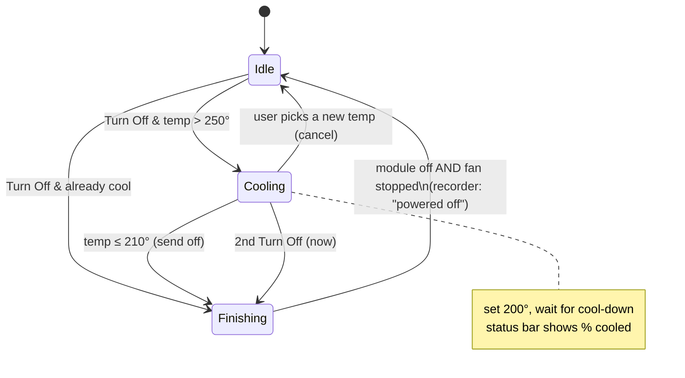

# 2. Graceful shutdown to prevent hopper burnback

Date: 2026-07-15

## Status

Accepted

### The incident that motivated this

This project began as a diagnosis: the grill would not come up to temperature.
Teardown showed the **auger motor was never turning**. The root cause was a
**burnback fire**: the grill had been powered off straight from high heat,
without first bringing it down to ~200°F for the cool-down. Fire crept up the
auger / pellet-tube assembly, **melted a plastic bushing in the auger housing,
and seized the auger motor** — which then had to be replaced. So this is not a
hypothetical hazard we are guarding against; it is the exact failure that
started the project.

### The hazard, generally

Turning a pellet grill straight off from a high cooking temperature is unsafe.
The firepot is still full of burning pellets; if the controller's cool-down fan
cycle doesn't run to completion, the fire can smoulder back up the auger tube
toward the hopper — a **burnback / hopper fire**. Pit Boss guidance (and common
practice) is to bring the grill down to a low temperature (~200°F) before
powering off, and to let the shutdown/cool-down cycle finish.

Our "Turn Off" button previously sent the raw `off` command immediately, at
whatever temperature the grill was running — the exact unsafe case that caused
the failure above.

We also want the user to be able to *see* the cool-down happening and trust that
it completed, rather than walking away unsure.

## Decision

Add a **graceful shutdown** flow, orchestrated in the **main process** so it
survives the window being closed/hidden mid-cool-down:

- Pressing **Turn Off** (window or tray) starts an `auto` shutdown. If the grill
  is above `coolAbove` (250°F), main sets the grill to `coolTarget` (200°F) and
  enters a **cooling** phase; once it reaches `coolDoneAt` (210°F) it sends
  `off` and enters a **finishing** phase. A cool grill powers off immediately.
- **Completion** is the existing power-off detection in the recorder: module off
  **and** the cool-down fan stopped. That fires the "powered off — session
  concluded" notification.
- A **second Turn Off press** (`now`) skips the cool-down and powers off. Picking
  a new temperature mid-cool-down (`cancel`) aborts the shutdown ("keep cooking").
- Progress is relayed to the renderer and shown in the status bar:
  "Shutting down — cooling to 200°: 320° now (58% cooled)", then "fan cooling the
  firepot…". A watchdog warns if the cool-down hasn't finished in 30 minutes.

The decision logic is a pure, dependency-free state machine
(`src/main/shutdown.ts`, unit-tested in `scripts/test-shutdown.mjs`); main.ts
executes the resulting `set_temp` / `off` commands and relays progress.

## Consequences

- Turning the grill off is now safe by default; the risky "off while hot" path
  requires an explicit second, confirmed press.
- The flow lives in main, so closing the window during a cook won't strand a
  half-finished shutdown.
- Thresholds (`coolAbove`/`coolTarget`/`coolDoneAt`/`stallMs`) are guesses until
  validated on the real grill; they're gathered in one `SHUTDOWN` block for
  tuning. See `docs/detection-test-plan.md` for the on-grill validation steps.
- Completion depends on the grill reporting `fanState` going false at the end of
  its cool-down; if a model doesn't, the watchdog still surfaces a warning.
