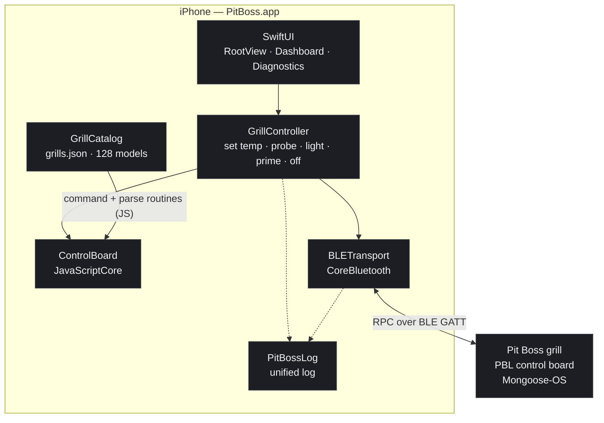
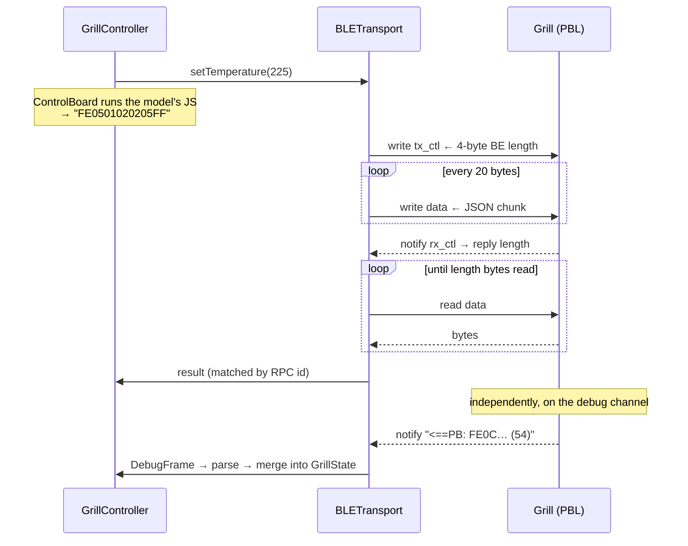

# 6. Native iOS app: port the protocol to Swift, keep the routines in JavaScript

Date: 2026-09-18

## Status

Accepted — **extended**. This ADR records the decision to build the app and how
the protocol was ported. The app has since grown well beyond what is described
here; the decisions made as it did are recorded separately:

- **ADR 0007** — sharing the cooking knowledge base with the desktop
- **ADR 0008** — a cook is the food, not the fire (cook continuity)
- **ADR 0009** — the cooking knowledge base (catalogue, methods, estimates)
- **ADR 0010** — resolving grill capabilities without a model number

Read the "Consequences" below as the position at the time of porting, not as the
current state of the app; `ios/README.md` is the current description.

## Context

The desktop app is Electron + a frozen Python sidecar (ADR 0005) that owns the
BLE link through `bleak` and `pytboss`. None of that runs on iOS: there is no
Python, no subprocess to spawn, and no Electron. Reaching the grill from a phone
means one of two things.

**A. Phone as a remote.** The Mac keeps the BLE link and serves the existing
renderer over the LAN; the phone is a browser. Cheap — a few hours — and every
feature (cook recorder, graceful shutdown, anomaly detection) comes along
unchanged. But it requires a Mac awake and within BLE range of the grill for the
phone to be useful at all.

**B. Native app over CoreBluetooth.** The phone talks to the board directly. No
Mac in the loop, but the protocol has to exist in Swift, and the sidecar's
higher-level behaviour does not come for free.

B was chosen deliberately, with the cost understood: it needs Xcode and an Apple
Developer account, and because BLE range is short the phone has to be near the
grill anyway — so it does not remove the "be near the grill" constraint, it only
removes the Mac.

The protocol itself is well-defined and was reversed from `pytboss` in full:
Mongoose-OS RPC over BLE (4-byte big-endian length on `tx_ctl`, body in 20-byte
writes to `data`, replies announced on `rx_ctl` and *read* back off `data`), with
grill state pushed as `FE0B` / `FE0C` frames on the debug-log characteristic.

The awkward part is not the transport. It is that **the per-model command
builders and frame parsers are JavaScript**, shipped as source inside
`grills.json` (the file Pit Boss's own API serves). `pytboss` does not
reimplement them — it runs them in a JS interpreter. 128 supported models across
19 control boards, each with its own parsing routine.

## Decision

**Port the transport and plumbing to Swift; run the per-model routines as
JavaScript on JavaScriptCore.**

- `ios/PitBossKit` — a platform-agnostic Swift package holding the whole
  protocol: `MongooseRPC` (UUIDs + framing + debug frames), `BLETransport`
  (CoreBluetooth), `ControlBoard` (JavaScriptCore), `GrillCatalog`, `Codec`
  (password obfuscation), `GrillController` (the command surface the sidecar
  exposes: set temp, set probe, light, prime, off, refresh).
- `ios/App` — the SwiftUI app. The only iOS-only code in the repo.

JavaScriptCore is a system framework on iOS and macOS, so this costs no
dependency. Hand-porting the routines would mean re-deriving 19 boards' parsers
and silently diverging from upstream the moment Pit Boss adds a model. One
difference from `pytboss`: it rewrites `let`/`const` to `var` and arrow functions
to `function` because duktape is ES5-only. JavaScriptCore is a modern engine, so
the routines run exactly as shipped — no scrubbing step.

**Model selection reuses ADR 0003's finding.** The board self-reports no grill
model — `Sys.GetInfo` returns `PBL-<MAC>` and nothing else identifying — so the
model cannot be auto-detected. What *is* detectable is the **control board**,
from the BLE name prefix. The iOS setup flow therefore does what the desktop
wizard does: derive the board from the advertised name, pre-filter the model
list to that board's grills (6 of 128 for PBL), and let the user pick once.
Because commands are defined at board level, a wrong pick still drives the grill
correctly — it only misreports capabilities. The full list stays reachable for an
unknown prefix.

**Correctness is pinned to pytboss, not to a reading of the protocol.**
`ios/Tools/generate-vectors.py` runs pytboss's own codec, command and parse
routines and dumps the results; `swift run pitboss-verify` asserts the Swift port
reproduces them. 582 checks, including every one of the 128 models.

## Consequences

**Good.**
- The phone reaches the grill with nothing else powered on.
- Adding a grill model is a `grills.json` refresh, not new Swift.
- The protocol layer builds and verifies on a Mac with **no Xcode** — CoreBluetooth
  and JavaScriptCore both exist on macOS. That keeps it CI-able on a bare runner.
- Divergence from pytboss is a test failure rather than a surprise on the grill.

**Bad / accepted.**
- **A second implementation exists.** A pytboss fix now has to be carried over by
  hand. The vectors are the tripwire: regenerate them after an upgrade and the
  checks fail loudly if behaviour moved.
- **The graceful shutdown IS ported** (`Shutdown.swift`), as a direct port of
  `src/main/shutdown.ts` — same thresholds (250/200/210, 30-minute stall
  watchdog), same phases, same cancel-on-new-temp and second-press-to-skip
  behaviour. The desktop's unit tests (`scripts/test-shutdown.mjs`) are ported
  case for case into `pitboss-verify`. **One platform difference matters:** the
  desktop runs the machine in the main process so it survives the window
  closing; iOS suspends a backgrounded app, so the app declares
  `UIBackgroundModes: bluetooth-central` to keep driving the cool-down from a
  pocket. If it is suspended anyway, the failure mode is benign — the grill
  holds at the 200° cool target rather than powering off hot — but the cook is
  left unfinished, which the cook must be told. Cook history and the activity
  timeline are ported too (`CookHistory.swift`), including the latching that
  keeps brief auger pulses visible.
- **Still desktop-only:** persisted cook history across launches, pellet-level
  estimation, anomaly detection (lid-open, flare-up), maintenance cycles, and
  notifications while backgrounded.
- **Executing JavaScript from a data file** is a widened attack surface. It is
  accepted because the file is vendored in the app bundle, not fetched at
  runtime, and JSContext has no access to the filesystem, the network, or the
  app's objects. See `SECURITY.md`.
- Xcode + an Apple Developer account are required to install on a device; a free
  account re-signs every 7 days.

## Architecture



## One RPC round trip

The reply is the non-obvious part: the board does **not** push the body. It
notifies the length, and the client then reads the data characteristic
repeatedly until it has that many bytes.



## Verification

```bash
.venv/bin/python ios/Tools/generate-vectors.py   # regenerate from pytboss
cd ios/PitBossKit && swift build && swift run pitboss-verify
python3 ios/Tools/check-contrast.py              # both themes meet WCAG AA
npm run ios:app                                  # build + run on the simulator
```

The conformance checks are an executable rather than an XCTest suite on purpose:
XCTest and swift-testing both ship *inside* Xcode, so a test target cannot run on
a machine with only Command Line Tools — and it keeps the protocol layer CI-able
on a runner with no Xcode image.

**Running it caught what building it could not.** The first launch looked fine
and was wrong in two ways: the UI ignored the system appearance entirely
(`@Environment(\.colorScheme)` read on an `App` rather than a `View` silently
returns a default, pinning every screen to the light palette), and the large
navigation title rendered white on the light background. A clean build reported
neither. Theme resolution now lives in a `RootContainer` view, which is also
where `toolbarColorScheme` gets set for the UIKit navigation bar.

Still unverified: **the app has never talked to a grill.** The simulator has no
Bluetooth radio, so `CBCentralManager` reports `.unsupported` and the whole BLE
path — scan, connect, RPC round trip, frame push — rests on the pytboss vectors
until it runs on hardware next to the grill.
