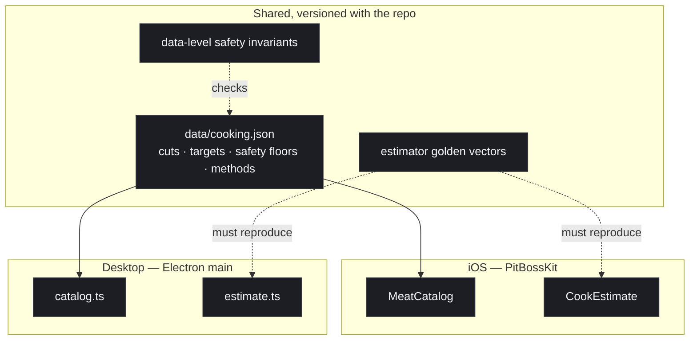

# 7. Sharing the cooking knowledge base between iOS and the desktop

Date: 2026-09-18

## Status

Accepted — 2026-09-18. **Implemented — 2026-09-18** (both sides).

Option B is in place end to end:

| Piece | Source of truth | iOS | Desktop |
| --- | --- | --- | --- |
| Cuts, targets, safety floors, methods | `data/cooking.json` | vendored into the SPM bundle | copied to `dist/data/` at build |
| Cook-time estimator | one algorithm, two ports | `CookEstimate.swift` | `src/shared/estimate.ts` |
| Estimator behaviour | `data/estimate-vectors.json` | `pitboss-verify` | `scripts/test-estimate.mjs` |

Both drift guards are wired into `npm test`:

- `scripts/sync-data.mjs --check` fails if a vendored copy of `data/` differs
  from the canonical file.
- The shared estimate vectors are run by **both** harnesses. This was verified
  by poisoning one expectation and confirming Swift and TypeScript failed on the
  same assertion — a vector file nothing actually exercises would look exactly
  like a passing one, so the guard itself was tested.

The desktop renderer does **not** carry a second copy of the estimator. It is a
plain browser script rather than a module, so `scripts/copy-assets.js` wraps the
compiled `src/shared/*.js` into an IIFE global (`PBEstimate`, `PBCooking`) and
fails the build if either file ever acquires a runtime `require()`.

## Context

The iOS app grew a body of cooking knowledge the desktop app does not have:

| Piece | What it is | Rough size |
| --- | --- | --- |
| `MeatCatalog` | ~45 cuts × targets, safety floors, notes | ~380 lines, mostly data |
| `CookMethod` | 3-2-1, 2-2-1, 0-400, Texas crutch, reverse sear, spatchcock, hot-and-fast | ~170 lines, mostly data |
| `CookEstimate` | Stall-aware ETA, pellet-outage allowance | ~170 lines, mostly logic |
| `MethodTimeline` | Stage scheduling and progress | ~110 lines, logic |
| Checks | Safety invariants, ordering, estimator behaviour | ~250 assertions |

The request is to have this on the desktop too. That is reasonable — it is the
same grill and the same cook — but it is a second implementation of a body of
knowledge where **being wrong has physical consequences**: a poultry target that
loses its 165° floor, or a brisket flat that is pulled after the point.

ADR 0006 already accepted one duplicated implementation (the BLE protocol) and
named its mitigation: golden vectors generated from pytboss, so divergence is a
test failure rather than a surprise. A second duplication needs the same rigour
or it will rot.

Worth separating two very different things:

- **Data** — cuts, targets, floors, method steps, thresholds. The bulk, and
  where a mistake is dangerous. Changes when knowledge improves.
- **Logic** — the estimator, stall phases, stage timing. Small, well-specified,
  and already pinned by assertions that could be ported in either direction.

## Options

### A. Port everything to TypeScript

Rewrite the catalogue and the logic for Electron.

- ✅ Each app is idiomatic and self-contained; no build coupling.
- ❌ **Two copies of the safety data.** A corrected chicken figure has to be
  fixed twice, and nothing makes the second fix happen.
- ❌ Doubles the surface where a typo has physical consequences.

### B. Share the data as JSON, port the logic *(recommended)*

Extract the catalogue and methods into `data/cooking.json`, consumed by both
apps. Port the ~300 lines of logic, and port the assertions with it.

- ✅ **One source of truth for every number that matters.** A safety floor is
  fixed once.
- ✅ Mirrors what the project already does with `grills.json` — a vendored data
  file read by both the Python sidecar and Swift. The pattern is proven here.
- ✅ The logic is small, pure, and already fully specified by checks; porting it
  is mechanical and verifiable.
- ✅ Editing cooking knowledge stops requiring a Swift build.
- ❌ Two implementations of the logic still exist, so the estimator could drift.
  Mitigated by shared golden vectors (below).

### C. Desktop reads what the phone produced

Do nothing shared; the phone stays the "smart" client and the desktop keeps
reading its cook files, which it already can.

- ✅ No work, no duplication, no drift.
- ❌ Doesn't answer the request. The desktop still can't pick a cut or estimate
  a finish time.

### D. Write the logic once in JavaScript, run it on both

Put the domain logic in JS; Electron runs it natively and iOS runs it through
**JavaScriptCore** — which this app already embeds to execute Pit Boss's own
per-model routines (ADR 0006).

- ✅ Genuinely one implementation of both data and logic.
- ✅ The precedent exists in this codebase and works.
- ❌ The iOS app's most safety-relevant logic becomes untyped and un-Swift,
  losing compile-time checking over exactly the values that matter.
- ❌ Awkward to test from the Swift side, and awkward to debug on a phone.
- ❌ Couples the two apps' release cycles through a shared runtime contract.

## Decision

**Option B**, if and when the desktop work is picked up.

Share the *data*, port the *logic*, and hold both implementations to the same
golden vectors — the pattern ADR 0006 established for the protocol:

1. `data/cooking.json` becomes the single source for cuts, targets, floors,
   methods and thresholds. Both apps load it; neither hard-codes a temperature.
2. The Swift safety invariants (every poultry cut offers 165°, nothing marked a
   safe minimum is below its own floor, the brisket flat comes off before the
   point) move to a data-level check that runs against the JSON, so they hold
   for whichever app reads it.
3. The estimator's behaviour is captured as vectors — input samples and events
   in, verdict out — and both implementations must reproduce them. This is the
   same tripwire used for pytboss, and it is what makes a second implementation
   safe rather than merely convenient.

**Sequencing.** The data extraction comes first and is done against iOS alone —
if `cooking.json` can drive the existing app with its checks still passing, the
format is proven before a second consumer depends on it. Only then does the
desktop side begin.

## Consequences

- Cooking knowledge becomes editable without a Swift build, which is the right
  shape for something that improves with experience.
- A safety correction lands in one place.
- Until it's done, the desktop stays a control-and-monitor app and the phone is
  where the cooking knowledge lives. That asymmetry should be stated in the
  desktop's README rather than left for someone to discover.
- If the data file is ever fetched rather than vendored, the JavaScriptCore
  reasoning in ADR 0006 applies — it must stay build-time content.

## Shape

