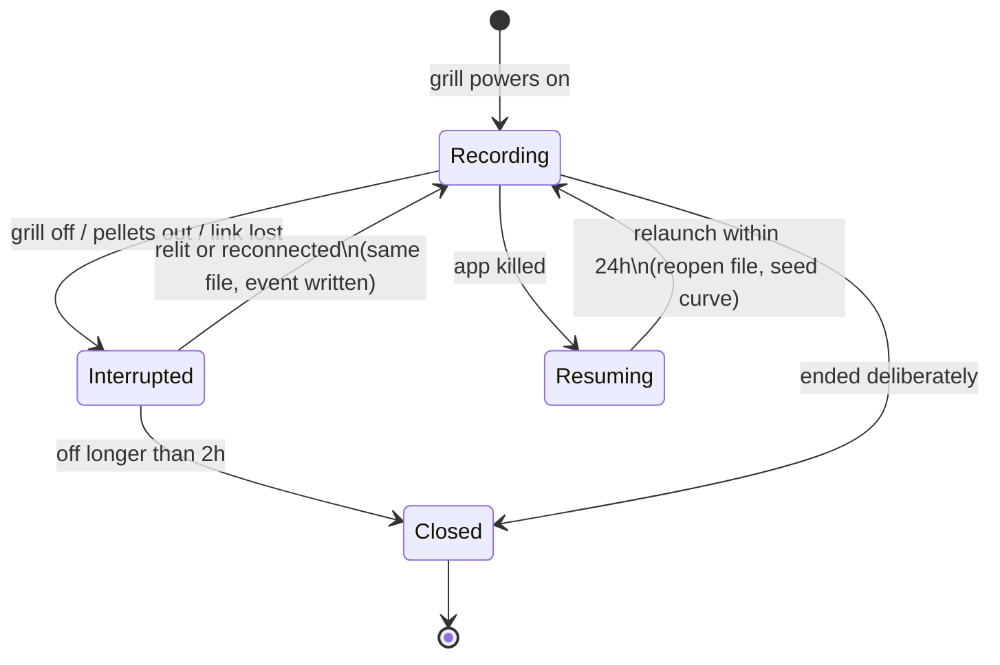

# 8. A cook is the food, not the fire

Date: 2026-09-18

## Status

Accepted. **Implemented — 2026-09-19** (both apps).

## Context

The desktop recorder starts a cook file when the grill's module powers on and
closes it when it powers off (`src/main/recorder.ts`). That is a clean rule and
it was fine until the iOS app was used for a full day of real cooking.

What actually happened on 2026-09-18, on one brisket:

- the hopper ran dry and the grill shut down, then was refilled and relit
- the phone app was restarted repeatedly (it was being developed against)
- the BLE link dropped several times at about -95 dBm

Under the power-on/power-off rule that single cook became **several files**,
each holding a fragment of the curve. Worse, the fragments were silent about
*why* they were fragments: nothing in the record said "the pellets ran out
here". The shape of the cook — the thing you would actually want to look back
at — was destroyed by the recording model.

The framing that resolves it came from the cook: **a cook is the food, not the
fire.** A pellet outage, a relight, a flat phone battery and a dropped link all
interrupt the *record*. None of them mean the brisket came off.

This also matches a principle the project already follows elsewhere: *absence is
a finding*. A gap you can see is data. A gap that silently splits the file is
lost information.

## Decision

A cook spans interruptions, and each interruption is written into the record.

1. **The grill going off does not end the cook.** It writes a `grill-off` event.
   Relighting writes `grill-on` and the same file continues.
2. **The cook closes only after `interruptionGrace` (2 hours) off**, or when
   ended deliberately. Long enough for a refill and a relight; short enough that
   tomorrow's cook is not appended to today's.
3. **Relaunching resumes.** An unfinished cook (no `end` line) started within 24
   hours is reopened for appending: the curve is seeded from what is already on
   disk, the session clock keeps the original start, and `app-resumed` is
   written. A banner says what was recovered.
4. **Interruptions are first-class records**, not log lines:
   `grill-off`, `grill-on`, `out-of-pellets`, `link-lost`, `link-restored`,
   `app-resumed`, `method-started`.
5. **Event lines use `at`, never `t`.** The desktop's `readCook` keeps any line
   with a numeric `t` as a temperature sample, so an event using `t` would be
   silently misread as a reading. This is checked by `npm run ios:interop`
   against the desktop's own parser.

## Consequences

**Good.**
- One brisket is one file, with its outage visible in it.
- A dead phone costs at most the last five-second interval, not the cook.
- Development against a live cook stops corrupting the record — the restarts
  are annotated as what they were.
- The estimator can use the outage events: a recent one adds about an hour to
  the remaining time (ADR 0009).

**Bad / accepted.**
- The two-hour grace is a guess. It survives the cases seen so far; a cook that
  is genuinely abandoned mid-session will stay open until it lapses.
- A cook left running with the grill on is never closed automatically. That is
  deliberate — the alternative is guessing that a cook ended — but it means the
  cook has to be ended by hand if the phone was away for the finish.
- `CookMeta` now carries events, so listing cooks parses whole files. Fine at
  this scale; would want an index if a season's worth accumulates.

## Shape

