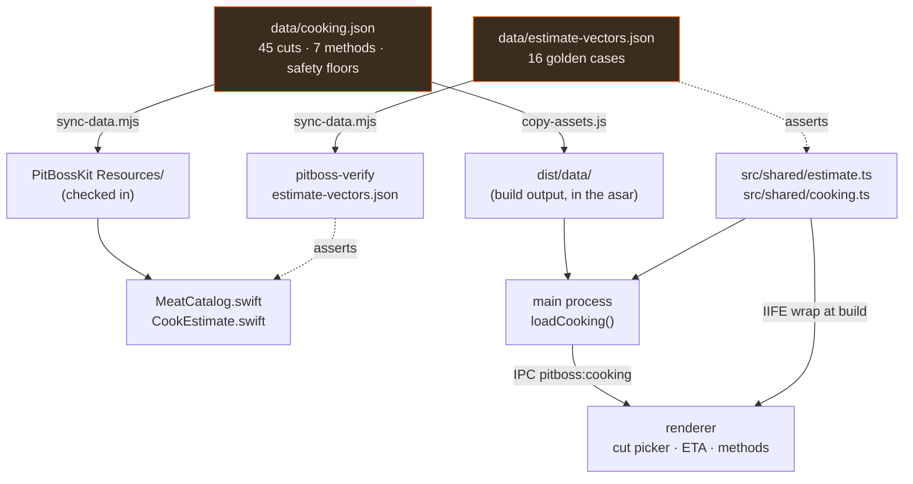
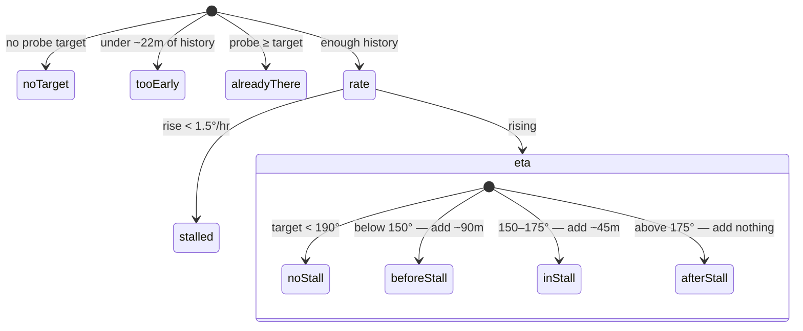

# Cooking knowledge, estimates and themes on the desktop

How the desktop app gained what the iOS app grew first: the cut catalogue, named
methods, stall-aware cook estimates, and a light theme. The decision behind the
sharing arrangement is [ADR 0007](adr/0007-sharing-the-cooking-knowledge-base.md);
this page is how it is actually wired.

## Where the knowledge lives

`data/cooking.json` is the single source of truth for every temperature that
matters — 45 cuts with their targets, seven named methods, and the USDA safety
floors. Neither app hardcodes any of it.



Two guards keep the copies honest, both run by `npm test`:

- **`scripts/sync-data.mjs --check`** — fails if a vendored copy differs from
  `data/`. Run `npm run data:sync` to update them.
- **`data/estimate-vectors.json`** — run by *both* the Swift harness and
  `scripts/test-estimate.mjs`. Change the estimator in one app and not the other
  and the build fails rather than the two quietly disagreeing.

> A vector file that nothing actually exercises looks identical to a passing
> one. The guard was checked by poisoning a single expectation and confirming
> both harnesses failed on the same assertion.

## One estimator, two consumers

The renderer is deliberately not an ES module — it compiles to a plain browser
script. Rather than keep a second copy of the estimator there (exactly the
duplication ADR 0007 exists to prevent), `scripts/copy-assets.js` wraps the
compiled CommonJS in an IIFE and exposes it as one global:

```js
var PBEstimate = (function () { var exports = {}; /* … */ return exports; })();
```

Both shared modules are type-only importers, so there is no `require` to
resolve. The build **throws** if that ever stops being true, rather than
emitting a script that breaks at runtime.

## What the estimator claims, and what it refuses to

A naive extrapolation through the stall produces answers like "41 hours", which
is worse than no answer because someone might believe it. So the estimator
returns a *reason* when it cannot give a number.



Every addition to the raw extrapolation is **declared**, never folded in
silently — an estimate that quietly contains two and a half hours of padding is
not the same claim as one that doesn't. The UI renders them:
`~4h 10m left · ready 8:20 PM · includes ~1½h for the stall and ~1h for the
pellet outage`.

A pellet outage costs about an hour the measured rate cannot see — by the time
the probe is climbing again the loss is behind it — so outages within the last
two hours are added explicitly. Older ones are already reflected in the
temperature the probe reached.

### Where outages come from

The recorder writes cook **events** alongside samples in the same JSONL file.
Events are keyed by `at`, samples by `t`, so each reader skips the other's
lines — which is what lets iOS and the desktop read each other's cook files
without either understanding all of the other's content.

| Event | Written when |
| --- | --- |
| `out-of-pellets` | the controller flag trips, **or** the thermal model infers a starving fire (whichever first — never both, or the hour gets double-counted) |
| `grill-off` / `grill-on` | the module powers down, or is relit while the record is still open |
| `link-lost` / `link-restored` / `app-resumed` | the record was interrupted, but the cook was not |

## Choosing a cut

The picker is two screens, and that is the whole design. Browsing shows every
cut; choosing one shows **that cut and nothing else**. Leaving other meats'
doneness levels on screen after a choice is what made the iOS version confusing,
and the fix is the same here.

The second screen distinguishes three kinds of number, because they are not the
same claim:

| Kind | Meaning |
| --- | --- |
| `safeMinimum` | a USDA floor — not a preference |
| `doneness` | a preference for whole-muscle cuts; some legitimately sit *below* the floor, and are labelled as such rather than hidden |
| `texture` | well above any safety threshold — collagen, not safety |

A cut may override its category's floor where the product genuinely differs: a
fully cooked ham being *reheated* is safe at 140°, while raw pork is 145°. The
floor is a property of the product, not the animal.

## Themes

The desktop was dark-only. It now honours `prefers-color-scheme` by default,
with a toolbar toggle (Auto → Light → Dark) that overrides the OS in **both**
directions and persists.

Every colour comes from the token layer, including the canvas charts: they read
the same custom properties through `token()` at draw time rather than carrying a
second hardcoded palette that only looks right in one theme.
`scripts/check-contrast.mjs` verifies every token pair against WCAG AA in both
themes and is part of `npm test` — it caught a pre-existing dark-theme failure
(`--danger` at 4.30:1 on `--bg-card2`) on its first run.

## Screenshots

`npm run screenshots` regenerates `docs/screenshots/` from
`screenshots.config.mjs`, driving the app's own Electron with a replayed cook
(`docs/fixtures/cook-sample.jsonl`) so no grill has to be attached.

`PITBOSS_REPLAY` feeds a recorded cook back through the normal event path.
It never writes to the recorder, and the renderer skips pellet integration while
a replay is driving it — a cook replayed at 400× would otherwise burn through
the hopper estimate and save that to the user's real settings. Four consecutive
screenshot runs leave `settings.json` byte-identical.
