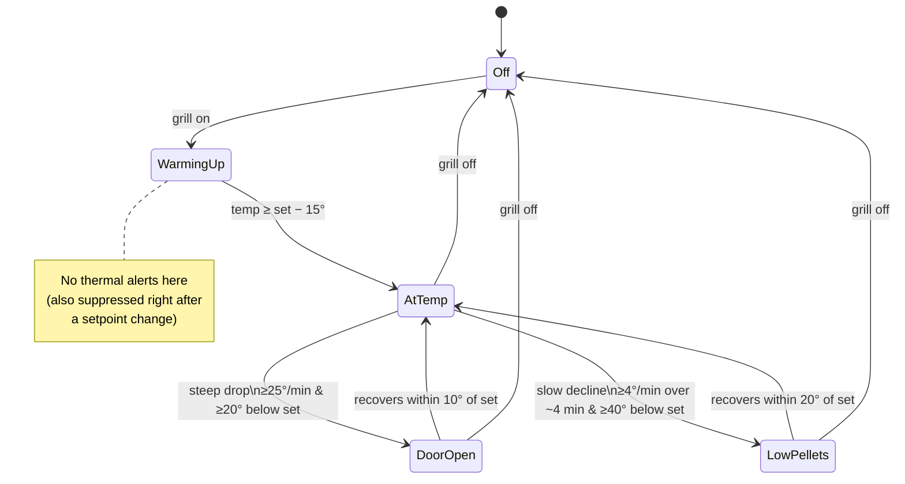

# Detection Test Plan — pellets, door/lid, probes

A hands-on plan to prove out the grill-monitoring alerts against the real grill
(Pro Series 1100 Combo, `PB1100PSC3`). It covers the thermal-anomaly detector
(`src/main/thermal.ts` + `Recorder.checkThermal`) and the existing probe / pellet
/ error alerts.

> These are edge-triggered notifications: each fires **once** and re-arms only
> after the condition clears. Thresholds live in the `THERMAL` block of
> `src/main/thermal.ts` — tune them here as real cooks reveal the right values.

## What the detector does



## Before you start

1. **Launch from the tree** so logs stream: `npm start`.
2. **Tail the unified log** in another terminal:
   `tail -f /tmp/openkb-pitboss.log`
   Every notification also logs a line: `notify: <title> — <body>`.
3. **Allow notifications** for the app (macOS System Settings → Notifications) so
   the banners actually appear when you're away from the screen.
4. Have a **full hopper** and, ideally, a **timer**. Some tests intentionally run
   the fire out — do them when you can safely tend the grill.

Key log signatures to watch for:

| Event | Log line contains |
|---|---|
| Reached setpoint | grill temp climbs to set − 15° (no alert; just observe) |
| Probe at target | `notify: <probe name> reached target` |
| Lid/door open | `notify: Lid open?` |
| Low/out of pellets (our heuristic) | `notify: Running low on pellets?` |
| Controller's own empty flag | `notify: Out of pellets` |
| Controller fault | `notify: Grill error` |

## Test cases

### T1 — Warm-up produces no false alarms
1. Start cold. Set grill to **250°F**. 
2. Watch the climb from ambient to 250°.
- **Expect:** *no* "Lid open?" or "pellets" notification during warm-up (the
  detector only judges once temp reaches set − 15°). Grill chart rises smoothly.

### T2 — Setpoint reached, steady hold
1. After T1, let it hold at 250° for ~5 min.
- **Expect:** no thermal alerts while it cycles around setpoint. Probe/grill
  mini-charts update.

### T3 — Probe target reached
1. Plug **Probe 1**, label it (e.g. "Chicken"), set target to a value just above
   its current reading (e.g. current + 5°).
2. Warm the probe (hand, or actual food coming up to temp).
- **Expect:** dot goes amber → green, subline shows "At target …✓", and a
  `notify: Chicken reached target` with a beep. Fires once.

### T4 — Door / lid open (the fast drop)
1. With the grill **held at 250°+**, open the lid and leave it open.
2. Watch the grill temp fall.
- **Expect:** within ~1 minute of a steep fall (≥25°/min and ≥20° below set), a
  **"Lid open?"** notification. The grill mini-chart shows a sharp downstroke.
3. Close the lid; let it recover.
- **Expect:** no repeat alert while recovering; the latch re-arms once temp is
  back within 10° of setpoint (so a *second* lid-open later fires again).
- **Tuning note:** if it fires too eagerly on brief peeks, raise `doorRate` or
  `doorMinDrop`; if it misses a real opening, lower them.

### T5 — Out of pellets (the slow decline)
> Do this at the end of a session when it's safe to let the fire die.
1. Hold at temp, then **let the hopper run empty** (or divert/empty it).
2. Watch the temp sag over several minutes as the fire starves.
- **Expect:** once temp is ≥40° below setpoint and still declining (≥4°/min over
  ~4 min), a **"Running low on pellets?"** notification — ideally *before* the
  controller raises its own empty flag.
3. If/when the controller sets its `noPellets` flag:
- **Expect:** the existing `notify: Out of pellets` fires, and our heuristic does
  **not** double-notify (it defers to the hardware flag).
- **Tuning note:** if it's slow to warn, lower `pelletDev` or `pelletRate`; if it
  false-fires on a normal deep auger cycle, raise them.

### T6 — Distinguish door vs pellets
1. Compare T4 and T5 timing/shape on the grill chart: door = **sharp** cliff;
   pellets = **gentle** sustained slope.
- **Expect:** the fast drop reads as "Lid open?", the slow drift as "pellets" —
  not the other way around. (The classifier unit test asserts this; T6 confirms
  it on real thermal mass.)

### T7 — Lowering the setpoint doesn't false-alarm
1. While holding 300°, drop the setpoint to **225°**.
2. Temp falls naturally to the new target.
- **Expect:** *no* "Lid open?" or "pellets" alert during the descent (a setpoint
  change resets the detector until temp settles at the new value).

### T8 — Re-arm after recovery
1. After a T4 lid alert and recovery, open the lid a second time.
- **Expect:** a fresh "Lid open?" fires (latch re-armed).

## Results log

| # | Test | Pass/Fail | Time-to-alert | Notes / tuning |
|---|------|-----------|---------------|----------------|
| T1 | Warm-up quiet | | | |
| T2 | Steady hold | | | |
| T3 | Probe target | | | |
| T4 | Lid open | | | |
| T5 | Out of pellets | | | |
| T6 | Door vs pellets | | | |
| T7 | Setpoint-down suppression | | | |
| T8 | Re-arm | | | |

## Automated coverage

The pure classifier is unit-tested independent of the grill:

```
npm test        # builds, then runs scripts/test-thermal.mjs (12 cases)
```

It covers: steady = quiet, steep = door, slow = pellets, warm-up suppressed,
`noPellets` flag deferral, and the rate-window math. The hardware tests above
validate the thresholds against real thermal behavior that the unit test can't.
