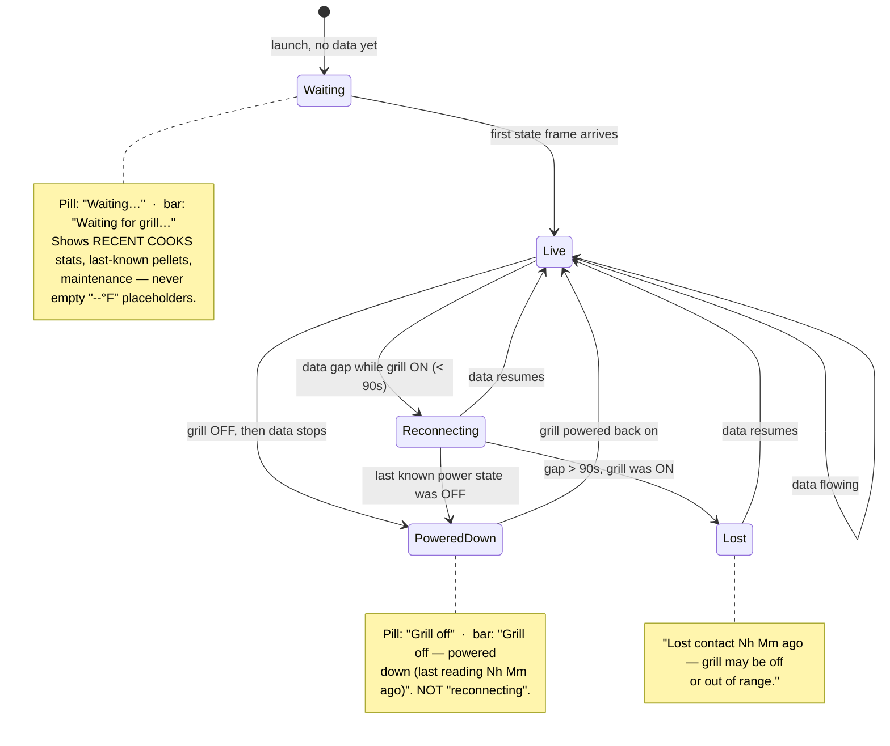

# Comprehensive On-Grill Test Plan

The master validation pass for a **real cook session** on the grill that started
this project (Pro Series 1100 Combo, `PB1100PSC3`, PBL board, firmware 0.5.7).
It exercises the whole product — connection lifecycle, controls, safety, the cook
recorder, and the session manager — end to end against real fire.

This plan is the umbrella. The anomaly-alert specifics (door-open vs. out-of-pellets,
re-arming, thresholds) live in **[`detection-test-plan.md`](./detection-test-plan.md)**
(cases T1–T8); this plan references them rather than duplicating.

> **Scope of a "session":** one power-on → cook → graceful shutdown, plus the
> disconnected/idle states around it. Budget ~2–3 hours for a full pass; a smoke
> pass (§A, §B, §D, §H) is ~30 minutes.

---

## Before you start

1. **Launch from the tree so logs stream:** `npm start`
2. **Tail the unified log** in another terminal: `tail -f /tmp/openkb-pitboss.log`
   — every notification also logs `notify: <title> — <body>`.
3. **Allow notifications** for the app (macOS System Settings → Notifications).
4. **Have the grill cool and off** to start, so §A (first-contact + power-up) is clean.
5. Record results in the **[log](#results-log)** at the bottom — date, firmware, pass/fail, notes.

Environment for this pass: Electron **43.1.1**, security scanners clean
(`gitleaks` / `osv-scanner` / `npm audit`), build + 13-test suite green.

---

## Connection lifecycle (the state machine)

Everything the header/status area shows is driven by two facts: **do we have fresh
data**, and **what was the grill's last known power state**. This is the subsystem
most recently reworked, so test it deliberately.

### A. First contact & the waiting screen
| # | Step | Expected |
|---|------|----------|
| A1 | Launch with the grill **off** | Pill: **"Waiting…"** (muted dot). Status bar: **"Waiting for grill…"**. No `--°F` / `TARGET °F` / "No data yet" cruft. |
| A2 | Observe the grill card while waiting | **RECENT COOKS** panel shows: N cooks · last cook (relative) · avg length · longest. **PELLETS** shows the last-known level (not `~-- %`). **MAINTENANCE** shows current status. |
| A3 | Power the grill **on** | Within a few seconds: pill → device name, bar → "Grill running / Raising temp…", live readout replaces the stats, session clock starts ticking. |

### B. Power-down detection (the headline fix)
| # | Step | Expected |
|---|------|----------|
| B1 | While connected & running, turn the grill **off** (physical panel or the app's Turn Off) | Bar transitions through "Powering down…" then, once BLE drops, **"Grill off — powered down (last reading …)"** — **never** an endless "Reconnecting…". Pill reads **"Grill off"** with a muted dot. |
| B2 | Leave it off for several minutes | The "last reading …" time humanizes (e.g. `2m`, `20h 36m`) — no raw `74168s`. |
| B3 | Power the grill back **on** | App reconnects on its own; live readout returns. |

### C. Reconnect vs. lost contact (grill still on)
| # | Step | Expected |
|---|------|----------|
| C1 | While running, walk the laptop out of BLE range briefly (< ~1 min), then back | Bar: **"Reconnecting… last reading Ns ago"**; recovers to live when back in range. |
| C2 | Stay out of range > 90 s | Bar escalates to **"Lost contact … — grill may be off or out of range."** Recovers when back in range. |

---

## D. Session clock
| # | Step | Expected |
|---|------|----------|
| D1 | During a live cook, watch the header **SESSION** clock | Ticks every second, flame-colored, `m:ss` then `h:mm:ss` past an hour. Matches wall-clock elapsed since power-on. |
| D2 | Reload the renderer (or relaunch) mid-cook | Clock re-seeds from the recorder's real cook start — does **not** reset to 0. |
| D3 | Turn the grill off | Clock returns to idle `—`. |
| D4 | Select a past cook in the dropdown | Label switches to **SESSION · COOK**, showing that cook's **total length** (static). |

---

## E. Core controls
| # | Step | Expected |
|---|------|----------|
| E1 | Tap each preset chip (180…500) | Grill setpoint follows; chips come from the grill's own increments. **Note: 275 is intentionally absent** — the PBL firmware's ladder skips 250→300 (documented behavior, not a bug). |
| E2 | Set probe 1 and probe 2 targets | Targets push to the controller; "N° to go / At target / OVER" sublines update. |
| E3 | Probes 3–4 (if plugged) | Read-only monitors — panel appears when a probe is inserted, no target field. |
| E4 | Lights on/off, Prime on/off | Button state reflects the grill's own reported state (not just the click). |
| E5 | Refresh | Pulls a fresh state frame. |

## F. Graceful shutdown (the safety feature that motivated the project)
| # | Step | Expected |
|---|------|----------|
| F1 | With the grill hot, hit **Turn Off** | Runs cool-to-200 → off → device cool-down. Bar shows "Shutting down — cooling to 200°: N° now (X% cooled)" then "fan cooling the firepot…". |
| F2 | During that commanded cool-down | **No flare-up false alarm** (the detector is suppressed while temp is legitimately above a lowered setpoint). |
| F3 | Cancel mid-shutdown | Returns to normal running status. |
| F4 | Confirm hopper outcome | No hopper burnback — the original bug this app exists to prevent. |

## G. Monitoring & safety alerts
Run the full **[detection-test-plan.md](./detection-test-plan.md)** T1–T8:
warm-up (no false alarm), steady hold, probe-at-target, door/lid fast-drop,
out-of-pellets slow-decline, door-vs-pellets discrimination, setpoint-drop
suppression, and re-arm after recovery. Log results there **and** summarize pass/fail here.

## H. Pellet estimate & maintenance
| # | Step | Expected |
|---|------|----------|
| H1 | Run a cook, watch **PELLETS** | Estimate decreases with auger run-time; "~N% · ~X of 20 lb · ~Yh left" reads sensibly. |
| H2 | Tap **Refilled** after topping the hopper | Estimate resets to full. **Emptied** marks empty. |
| H3 | Calibrate feed rate (Settings) | Adjusting lbs/hr shifts the estimate; note the value that matches reality. |
| H4 | Complete a cook | Maintenance **cooks-since-clean** increments; cleaning reminder appears at the threshold. |
| H5 | Tap **Cleaned** | Counters reset. |

## I. Cook recorder & history
| # | Step | Expected |
|---|------|----------|
| I1 | Run a cook to completion | A cook file is written; it appears newest-first in the dropdown, "· live" while running. |
| I2 | Select a finished past cook | **Past-cook summary** header shows `date · time` and `Duration · Peak · Avg · N readings` — **not** the empty live `-- --°F`. The chart + component-activity show that cook's data. |
| I3 | Custom probe labels | Labels set during a cook are snapshotted into that cook's record. |

## J. Session manager (delete + rename + quick-clean)
| # | Step | Expected |
|---|------|----------|
| J1 | Toolbar → **Sessions** | Modal lists every cook: date·time, duration·readings·device, checkbox, name field, 🗑. |
| J2 | Type a **name/note** on a real cook | Persists (blur/Enter); appears on next open and in the dropdown metadata. |
| J3 | **Select likely test cooks** | Pre-checks short/barely-sampled cooks (< 5 min or < 10 readings). |
| J4 | **Delete selected (N)** → confirm | Selected cooks removed from disk and the list; dropdown + stats refresh. |
| J5 | Delete a single cook via 🗑 → confirm | Removed; if it was the one being viewed, the chart snaps back to Live. |
| J6 | Try to delete the **active (recording)** cook | Refused with a toast — the live cook can't be removed. |
| J7 | (Sanity) app never lets an out-of-range id through | Path-traversal ids are rejected in the backend (verified in code; no UI path exposes them). |

## K. OS integration & notifications
| # | Step | Expected |
|---|------|----------|
| K1 | Close the window | App stays alive in the **tray** (grill keeps being monitored). |
| K2 | Tray menu | Core actions present (Turn Off, etc.); reflect live enable/disable. |
| K3 | Native notifications | Probe-at-target, out-of-pellets, controller-error, grill-started, shutdown all fire as banners while away from the screen. |
| K4 | Start-at-login (packaged build only) | Toggle in Settings reads/writes the OS Login Item; `openAsHidden` boots to tray. |

## L. Packaging & permissions (DoD gaps — validate when closing them)
| # | Step | Expected |
|---|------|----------|
| L1 | Run the **packaged `.app`** from a clean machine | Bundled venv/sidecar work; connects and controls end to end. |
| L2 | First BLE use on packaged app | macOS Bluetooth permission prompt appears (via `NSBluetoothAlwaysUsageDescription`); a denied state shows guidance + self-heals on grant. |
| L3 | Auto-reconnect across real BLE drops | Proven over an actual short-range antenna drop, not just simulated. |

---

## Results log

| Area | Date | Firmware | Result | Notes / bugs surfaced |
|------|------|----------|--------|-----------------------|
| A. First contact / waiting |  | 0.5.7 |  |  |
| B. Power-down detection |  | 0.5.7 |  |  |
| C. Reconnect / lost |  | 0.5.7 |  |  |
| D. Session clock |  | 0.5.7 |  |  |
| E. Core controls |  | 0.5.7 |  |  |
| F. Graceful shutdown |  | 0.5.7 |  |  |
| G. Alerts (T1–T8) |  | 0.5.7 |  | (detail in detection-test-plan.md) |
| H. Pellets / maintenance |  | 0.5.7 |  |  |
| I. Cook recorder / history |  | 0.5.7 |  |  |
| J. Session manager |  | 0.5.7 |  |  |
| K. OS integration |  | 0.5.7 |  |  |
| L. Packaging / permissions |  | 0.5.7 |  |  |

### Bugs surfaced by this pass
_(List findings here as they come up — the previous on-grill pass surfaced three
fixes this way, which is exactly the point of running against real fire.)_

1.
2.
3.
