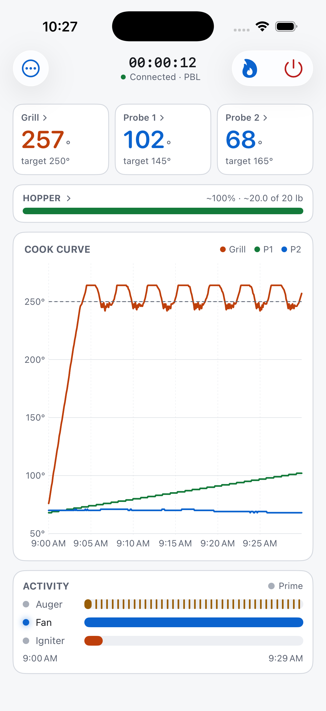
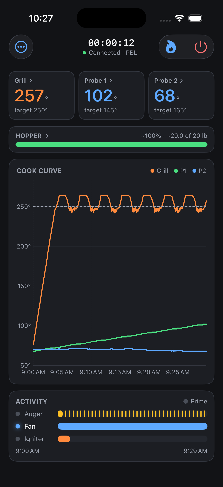

# openkb-pit-boss — iOS

A native iPhone/iPad app that talks to a Pit Boss grill **directly over
Bluetooth**. No Mac in the loop, no Dansons cloud, no account.

Decision and architecture: [`docs/adr/0006-native-ios-app.md`](../docs/adr/0006-native-ios-app.md).

## Layout

| Path | What it is |
| --- | --- |
| `PitBossKit/` | The protocol, as a platform-agnostic Swift package. Builds and verifies on macOS with **no Xcode**. |
| `PitBossKit/Sources/PitBossKit/MongooseRPC.swift` | BLE UUIDs, length framing, debug-frame parsing |
| `PitBossKit/Sources/PitBossKit/BLETransport.swift` | CoreBluetooth transport (scan, connect, RPC) |
| `PitBossKit/Sources/PitBossKit/ControlBoard.swift` | Per-model command + parse routines, via JavaScriptCore |
| `PitBossKit/Sources/PitBossKit/GrillCatalog.swift` | `grills.json` — 128 models, 19 control boards |
| `PitBossKit/Sources/PitBossKit/GrillController.swift` | The command surface: temp, probe, light, prime, off |
| `PitBossKit/Sources/pitboss-verify/` | Conformance checks against pytboss |
| `App/` | The SwiftUI app — the only iOS-only code in the repo |
| `Tools/generate-vectors.py` | Regenerates the golden vectors from pytboss |
| `Tools/check-contrast.py` | Asserts both themes meet WCAG AA |

## Verify the protocol layer (no Xcode needed)

```bash
cd ios/PitBossKit
swift build            # must be warning-free
swift run pitboss-verify
```

Expect `✓ 582 checks passed`. This exercises **every one of the 128 grill
models**, not just the one the project was developed against.

The expectations come from pytboss itself — `ios/Tools/generate-vectors.py` runs
its real codec/command/parse routines and dumps the results. So the bar is "the
Swift port behaves like the library the desktop app already trusts", not "the
port matches somebody's reading of the protocol". **After upgrading pytboss,
regenerate and re-run:**

```bash
.venv/bin/python ios/Tools/generate-vectors.py
cd ios/PitBossKit && swift run pitboss-verify
```

A failure there means upstream behaviour moved and the port needs the same change.

## Build and run

> **Toolchain gotcha on this machine.** Xcode 26.6 is installed, but
> `xcode-select -p` points at `/Library/Developer/CommandLineTools`, so
> `xcodebuild` reports *"requires Xcode, but the active developer directory is a
> command line tools instance"*. That does **not** mean Xcode is missing. Either
> export `DEVELOPER_DIR` per invocation (no sudo, no global change — this is what
> `npm run ios:app` does), or fix it globally with
> `sudo xcode-select -s /Applications/Xcode.app/Contents/Developer`.

Simulator, one command:

```bash
npm run ios:app          # build + install + launch on the iPhone 17 Pro simulator
```

Or by hand:

```bash
export DEVELOPER_DIR=/Applications/Xcode.app/Contents/Developer
cd ios/App
xcodebuild -project PitBoss.xcodeproj -scheme PitBoss \
  -sdk iphonesimulator -destination 'platform=iOS Simulator,name=iPhone 17 Pro' build
```

**The simulator has no Bluetooth radio** — `CBCentralManager` reports
`.unsupported` there, so scanning can never find a grill. The simulator is good
for the UI, the catalogue and the theming; the BLE path only means anything on
real hardware.

### On your iPhone

1. `open ios/App/PitBoss.xcodeproj`
2. Target **PitBoss** → **Signing & Capabilities** → set **Team** to your Apple ID.
   - Bundle id is `com.openkb.pit-boss.ios`; change it if it collides.
3. Plug the phone in, pick it as the destination, ⌘R.
4. On the phone: **Settings → General → VPN & Device Management** → trust the
   developer certificate. (First install only.)

**Signing:** this machine has a paid Apple Development identity
(team `24PG2KGN86`, set as `DEVELOPMENT_TEAM` in the project) with a wildcard
provisioning profile valid to **2027-09-13**, so an installed build keeps
launching for the life of the profile. (A *free* Apple ID would re-sign every 7
days instead — not the case here.)

Install straight from the command line, no Xcode UI:

```bash
export DEVELOPER_DIR=/Applications/Xcode.app/Contents/Developer
cd ios/App
xcodebuild -project PitBoss.xcodeproj -scheme PitBoss -sdk iphoneos \
  -destination 'platform=iOS,id=<device-udid>' \
  -derivedDataPath /tmp/pbdevice -allowProvisioningUpdates build
xcrun devicectl device install app --device <device-id> \
  /tmp/pbdevice/Build/Products/Debug-iphoneos/PitBoss.app
xcrun devicectl device process launch --device <device-id> com.openkb.pit-boss.ios
```

`xcrun devicectl list devices` gives the device id. To read the app's log back
off the phone:

```bash
xcrun devicectl device copy from --device <device-id> \
  --domain-type appDataContainer --domain-identifier com.openkb.pit-boss.ios \
  --source "Library/Application Support/openkb-pit-boss.log" --destination /tmp/phone.log
```

## Screenshots

```bash
npm run ios:screens      # build → simulator → replay → PNGs in docs/screenshots/ios/
```

One command, no grill attached and no hand-staging. The driver launches the
app's own simulator build with `PITBOSS_REPLAY=<cook.jsonl>`, so the populated
dashboard is produced by the **real** parsing and rendering path rather than
mocked-up views — if the cook format changes, the shots break.

| Light | Dark |
| --- | --- |
|  |  |

> ⚠️ These are replayed from a **synthetic fixture**
> (`ios/Tools/make-fixture-cook.mjs`), not recorded grill data — the curve is
> plausible, not real. To document real behaviour, pass an actual recorded cook:
> `node ios/Tools/screenshots.mjs ~/path/to/cook.jsonl`. The setup screens are
> captured from the genuine device-absent state.

## Inspecting the UI without a grill

`PITBOSS_REPLAY=<path to a cook .jsonl>` replays a recorded cook through the
app; `PITBOSS_REPLAY_RATE` sets the speed-up (default 60×). This is the iOS
counterpart to the desktop's `PITBOSS_SHOT`, and it is how layout work gets done
without lighting the grill.

## Picking the grill model

The grill advertises as `<BOARD>-<MAC>` — e.g. `PBL-F4CFA2B1F294`. That prefix
names the **control board**, not the model, and the board self-reports no model
anywhere (ADR 0003 probed this on a live PB1100PSC3). So the model cannot be
auto-detected by any app, this one included.

What the setup flow does instead: derive the board from the advertised name and
pre-filter the picker to that board's models — 6 of 128 for `PBL`. Commands are
defined at board level, so every PBL grill is driven identically; the model only
refines the displayed temp ladder, probe count and lights. When the board narrows
it to exactly one model, it is selected for you.

## Staying connected

A cook runs for hours and a phone wanders out of range, so a dropped link is
expected, not exceptional. The app keeps **intent** separate from **state** (the
same `want_connected` distinction the desktop sidecar draws): losing the link
starts recovery rather than failing.

### The system holds the reconnect, not the app

**A dropped link is recovered by CoreBluetooth, not by a retry loop.**
`central.connect` has no timeout, and that is the feature: it is a *standing
request* the system keeps until the peripheral comes back, and it completes
**while the app is suspended** (the `bluetooth-central` background mode). On an
unexpected disconnect the transport re-arms it immediately and the controller
waits.

This replaced an app-level backoff ladder that could not work for the real case.
The ladder is `Task.sleep` on the main actor; iOS freezes it the moment the phone
goes in a pocket, which is exactly when a six-hour cook needs it. Worse, the old
code wrapped every connect in a 90-second timeout and then *cancelled* it —
throwing away the one mechanism that would have reconnected on its own.

The measured difference on a real grill at -95 dBm:

| | Before | After |
| --- | --- | --- |
| Recovery from a drop | never, unaided — every recovery in the log came from relaunching the app by hand (gaps of 2, 12 and 40 minutes) | **17s, automatic** (`05:18:03` lost → `05:18:20` restored) |

### Division of labour

Two mechanisms, deliberately not overlapping — two connects racing on one
peripheral is how the backstop ends up cancelling the primary:

| Situation | Who recovers it |
| --- | --- |
| A link that was once up drops | the system-held standing connect |
| The grill isn't advertising at connect time | a standing connect is armed on the remembered radio, so it links when the grill returns |
| A connect that never established | the app's backoff ladder — **3s → 6 → 12 → 24 → 30**, capped at 30s (`ReconnectPolicy`) |

- `.awaitingReconnect` is its own phase, not `.reconnecting` with a zero
  countdown: it is a different promise to the cook — *"will reconnect on its own,
  even if you close the app"* — and inventing a countdown for it would be a worse
  answer, not a more precise one.
- The status bar names the state and, where there is one, the next attempt
  ("Lost the grill — retrying in 12s (attempt 3)") instead of a spinner that
  could equally mean hung.
- Readings **dim while the link is down**, so a frozen number is never presented
  as live.
- Only an explicit disconnect (⋯ → Disconnect) stops it; that disarms the
  standing connect first, or the app would immediately reconnect to a grill the
  user just let go of.

### Why the scan is still there

A first connect **scans**, even though the radio is remembered. Connecting to a
*retrieved* peripheral that has not just been seen issues a pending connect the
system completes whenever the device next advertises — right for reconnecting,
wrong for a first connect, where it sits silently instead of failing.

Measured: skipping the scan turned a ~15s connect into no connect and no message
at all, because the app suspended and its own timeout could never fire. The
remembered radio is therefore used only to arm a standing connect, never to skip
discovery.

Because a suspended app cannot run its own timeout, `recycleStaleConnect()` runs
when the app returns to the foreground and starts over any connect that has been
pending longer than the timeout — the wall clock being the only honest measure of
a stretch during which no timer of ours was running.

### Things that bit, and are now guarded

- **A cancelled task does not interrupt an await already in flight.** A ladder
  attempt cancelled mid-connect still returned success afterwards and applied its
  success tail against a link that had since dropped — starting a poll loop that
  logged `PB.GetState failed: Not connected` every five seconds forever. Both the
  ladder (re-checks cancellation) and the poll loop (stops itself when the
  transport is down) now guard it.
- **Silent guards hid all of this.** The reconnect decision had three paths that
  returned without logging, so "never reconnected" was indistinguishable from
  "reconnected slowly". Every one of them now says why.

**Signal matters.** The grill advertises weakly; anything past about -85 dBm is
marginal and the scan list flags it. A link that keeps dropping at -95 dBm is a
range problem, not a software one.

## Diagnostics

A phone has no terminal to tail, so the desktop app's unified
`/tmp/openkb-pit-boss.log` lands here as a **Diagnostics** screen (⋯ menu):
every subsystem's output in one place, selectable, with a share sheet. Reading
it should never require Xcode and a cable.

## Status

Builds clean (0 warnings), runs on the simulator, loads all 128 grill models,
and follows the system light/dark appearance with an in-app override. **It has
not yet talked to a grill** — that needs the app on a phone, next to the grill.

## Setting the grill temperature

Tap the Grill tile. **Only the controller's own setpoints are offered — there is
deliberately no free-entry dial.**

This is a real constraint, not a simplification. The PBL firmware has a fixed
ladder that skips 250→300 (`docs/test-plan.md` E1: *"275 is intentionally
absent … documented behavior, not a bug"*), the desktop app has only ever sent
values from that ladder, and nothing establishes what the board does with a
value it doesn't have. An earlier version of this screen had a ±5° stepper and
told the user the grill would "snap to its nearest step" — that was invented,
and it is gone.

### Which ladder?

The ladder is per **model**, and `grills.json` carries it for all 128 — the
missing link is that the firmware reports no model (ADR 0003). PBL spans exactly
two ladders:

| steps | values | models |
| --- | --- | --- |
| 10 | 180 200 225 250 300 350 400 450 475 500 | PB1100PSC2/PSC3 |
| 19 | 180 190 200 … 300 325 350 375 400 450 500 | PB1150PS2, PB1600PS1, PB850PS2 |

**The default is the shortest.** That asymmetry is deliberate: a setpoint the
controller doesn't have fails *silently* — you tap it and nothing happens, with
no way to tell why — whereas a missing one is visible and one tap away. It also
matches the evidence in this repo: `docs/test-plan.md` E1 records the PBL
firmware's ladder skipping 250→300, which is the 10-step ladder. The longer
entries in the catalogue look like chassis dial markings rather than firmware
behaviour.

Correcting it is **"My grill has different steps"**, which shows the candidate
ladders *as their values* and asks which matches the grill's display. Nobody
should have to find a part number on a sticker to fix a list of numbers.

Observation still refines either choice: a setpoint the grill demonstrably
refused is dropped, and one it accepted is added even if no catalogue ladder
lists it (`LadderInference.swift`). Every `requested → reported` pair is logged.

**Probe targets are different** and *are* free-entry, matching the desktop —
there the control is a plain number input, because a probe target is a
threshold, not a firmware ladder position.

## Grate calibration

The controller's sensor sits on the barrel wall near the controller, not at
grate level, so a thermometer on the grate usually reads lower — **a 25–50° gap
is normal and is not a failed sensor.** ⋯ → **Grate calibration** records the
difference and the dashboard then shows both (`Grill 250° / grate ~200°`).

It is **display only**, deliberately. The setpoint you send, the cool-to-200
shutdown chain, lid-open and flare-up detection all keep using the controller's
own value, because that is the number the controller itself acts on — an offset
that silently shifted the safety thresholds would be a dangerous setting. Cook
files also store the raw value, so an old cook still means what it meant.

## Start a cook

⋯ → **Start a cook…** sets the whole thing up in one action: pick a cut and the
grill temperature, the probe target and the probe's name are all applied. The
catalogue knows both halves — a brisket wants 250° in the chamber and 203° in
the meat — so making you set them separately was busywork.

It shows exactly what it will do first, and **never substitutes a temperature
silently**. A cut's recommendation is culinary advice; the controller only takes
its own ladder. Turkey is usually 325°, which a PBL grill doesn't have, so the
confirmation says: *"usually cooked at 325°, which isn't on this grill's ladder
— using 300° instead."* Ties round **down**: undershooting costs time,
overshooting costs the food.

A target below its safety floor is flagged here too, and the probe picker offers
the probes this grill has actually reported — not the board-wide maximum, which
is four for PBL and wrong for a two-probe grill.

### Cuts split by portion

Where two parts of the same animal genuinely cook differently, they're separate
entries rather than one averaged guess:

| | portions |
| --- | --- |
| **Brisket** | whole packer 203° · flat (lean) 200° · point (deckle) 205° · burnt ends 207° |
| **Pork shoulder** | butt (upper) 203° · picnic (lower) 205° |
| **Ribs** | spare · St. Louis · baby back 199° |

Checks enforce the orderings that matter — the lean flat comes off before the
fatty point, leaner baby backs finish at or before spares — because a data typo
swapping those would look plausible in review and only show up on the grill.

## Probe targets

Tap a probe tile to set what you're cooking to, and name it. **Choose a cut**
opens a searchable catalogue of ~40 cuts across beef, pork, poultry, lamb,
seafood and ground meats; picking one sets the target *and* names the probe, so
an alert reads "Brisket reached target" rather than "Probe 1".

### Choosing is two steps, and the number stays yours

The picker **drills down** rather than expanding inline: pick a cut and the
screen is only about that cut. An earlier version expanded the selection in
place, which left a list of unrelated meats around the thing you'd just chosen.

Back on the probe, the options become **that cut's** targets — a brisket point
offers *Tender 205°* and *Burnt ends 207°*, not the generic landmarks. Showing
"Poultry 165°" under a brisket is noise at best.

The catalogue is a starting point, never a constraint. The stepper always wins,
and the provenance stays honest when it does:

> Brisket — point (deckle) · Tender suggests 205° — using your 207°

A value stepped below the safety floor is flagged against the *current* number,
not the one originally picked.

### Three kinds of number, kept apart

The catalogue never flattens these together, because they are not the same sort
of value and treating them alike is how someone talks themselves out of the
first one:

| kind | meaning | example |
| --- | --- | --- |
| **Safe minimum** | USDA FSIS floor — not a preference | Poultry 165°, ground 160°, whole muscle 145° |
| **Doneness** | A preference for whole-muscle cuts | Steak: rare 125° … well 160° |
| **Texture** | Where collagen renders, far past any safety line | Brisket 203°, pork butt 203° |

Each category header carries its safe minimum, and a target **below** the floor
— rare steak, medium-rare duck — is offered but labelled *"under 145°"*. Those
are legitimate choices people make; hiding them would be paternalistic, and
hiding the fact they're under the floor would be worse.

The floor is per **cut** where the product genuinely differs: a fully cooked ham
being reheated is safe at 140°, while raw pork is 145°. A verification check
enforces that every poultry cut offers 165° and that nothing marked a safe
minimum sits below its own floor — the one class of bug here with physical
consequences.

**Brisket is split by portion**, because the two muscles cook differently and
one combined entry is how a flat ends up dry:

| portion | target | why |
| --- | --- | --- |
| Whole packer | 203° | Probe the *flat* — the lean muscle decides, the point reads hotter |
| Flat (lean) | 200° | Little fat to protect it; a few degrees past done is dry |
| Point (deckle) | 205° | Fatty and full of collagen, wants more heat |
| Burnt ends | 207° | Separate the point at 195–200°, cube, sauce, return |

A check enforces the ordering — the flat must come off before the point. Getting
that backwards would actively make briskets worse.

Barbecue cuts suggest their *texture* temperature rather than a safety floor,
because a brisket pulled at 145° is safe and inedible.

**Targets are kept on the phone for every probe, and sent to the grill only when
the board can accept them.** This is not a shortcut — most boards genuinely
cannot be told about more than one probe. The PBL board this project was built
against has `set-probe-1-temperature` and *no* probe-2 equivalent; across the
whole catalogue 38 boards accept a probe-1 target and 27 accept probe 2. The
sheet says which is happening, so a probe-2 target that never appears on the
grill's own display doesn't read as a bug.

Alerting is edge-triggered, ported from the desktop recorder:

- **Reached target** fires once, then holds. It re-arms only when the reading
  falls more than 2° below the target, so a probe hovering on the line doesn't
  buzz every five seconds.
- **Over target** is a separate, louder event at 5° past — overcooking is a
  different problem from being done.
- An unplugged probe reads nil and never alerts; a target of 0 means "unset".

## Prime and power off

Both live in the title bar, and both confirm — they're the two controls that can
do something you can't undo by tapping again.

**Prime is a momentary 5-second burst**, not a toggle: on, countdown, off. The
desktop does the same, and for good reason — a toggle means a missed second tap
leaves the auger feeding pellets into the firepot. If the stop command fails the
app says so loudly rather than quietly leaving the motor running. Priming a
*lit* grill warns first, because most boards only run the primer from idle, so
mid-cook it's usually a no-op.

**Power off** confirms and says what will actually happen — a hot grill reports
"it will cool to 200° first, then power off". **Skipping the cool-down** gets its
own separate confirmation, since that is precisely the action that caused the
burnback this project exists because of.

## App icon

Shared with the Electron app: **the same generator**, not a copy of the artwork.
`scripts/make_icon.py` composes the flame procedurally and now emits both:

```bash
npm run icon      # macOS .icns + iconset, tray templates, and the iOS 1024
```

The iOS icon differs in exactly one way, because Apple requires it: it is a
**full square with no alpha**. iOS applies its own corner mask, so a pre-rounded
icon shows dark corners inside the rounded shape, and the App Store rejects an
alpha channel outright. `render(radius_factor:)` takes the corner radius as a
parameter so the artwork itself stays shared.

Xcode generates every size it needs from the single 1024 in
`ios/App/PitBoss/Assets.xcassets/AppIcon.appiconset/`.

## The title bar

Two lines, because both used to cost a full row of the content area:

```
        00:00:11
   ● Connected · PBL
```

The second line names the **control board** until the setpoint observations
narrow to a single model, at which point it shows that model instead — e.g.
`Connected · PB1100PSC3`. A model name there means it was *deduced* from what
the grill accepted, never read off the device; the firmware reports no model.

Prime (flame) and power-off sit on the right; ⋯ on the left holds cook history,
diagnostics, appearance and disconnect.

## Anomaly detection

Ported from `src/main/thermal.ts`, watching for two patterns once the grill has
reached its setpoint:

- **Lid open** — a steep, sudden drop (≤ -25°/min while ≥20° below setpoint).
- **Starving fire / low pellets** — a slow sustained decline (≤ -4°/min while
  ≥40° below), caught *before* the controller's own `noPellets` flag.

Telling them apart is the whole job: both are "temperature falling", and the
difference is the slope. A lid opening explicitly suppresses the pellet verdict,
so one spritz doesn't also report a dying fire.

Nothing fires during warm-up, and **changing the setpoint starts a fresh
regime** — otherwise lowering the temperature would read as a lid opening every
time, since that is exactly the same signature. Each anomaly latches, so it
notifies once per occurrence rather than every five seconds while it persists.
The desktop's unit tests are ported case for case.

## Notifications

Alerts also go to the lock screen — probe done, out of pellets, flare-up, lid
open, errors, shutdown progress. Without this, walking away from a long smoke
doesn't work, which is the point of the app.

Permission is asked on **first connect**, not at launch, so the prompt arrives
with obvious context. Banners are suppressed while the app is on screen, where
the in-app notice already says it. Fire-safety alerts (flare-up, over
temperature, a primer that wouldn't stop) are marked time-sensitive so they can
break through a Focus mode; a probe reaching target is not — if everything is
urgent, nothing is.

This depends on the `bluetooth-central` background mode keeping the app alive
while it holds the BLE link.

## Before you cook

On launch — once per launch, and never over a cook already running — the app
offers a two-item checklist: **clean the firepot** and **fill the hopper**.

It is a checklist, not a gate. Every item has a plain **Skip** next to **Did it**,
and **Skip all** sits in the title bar. A prompt that is hard to dismiss gets
dismissed carelessly, which is worse than one that is easy to dismiss honestly.

Answering is not cosmetic:

- **Did it** on the firepot resets the maintenance counters
- **Did it** on the hopper resets the pellet estimate to full

which is exactly what keeps both readouts meaningful. Each item shows why it is
being asked — "Due after 5 cooks, 31h of use" or "Estimated ~18% · ~3.6 of 20 lb"
— and turns amber when it is genuinely due. Reachable any time from
⋯ → **Pre-cook checklist**.

### Maintenance tracking

Ported from `src/main/maintenance.ts` with the same thresholds: a clean is due
after **5 cooks**, **30 hours** of run-time, or **3 flare-ups**. Flare-ups count
because a grill reading 100°+ over its setpoint usually means a grease fire in
the barrel, and repeated ones mean the drip tray needs emptying — a fire-safety
matter, not housekeeping. The desktop's unit tests are ported case for case.

## Pellet hopper estimate

A slim bar under the temperature tiles: `~62% · ~12.4 of 20 lb · ~3h 10m left`.
Tap it to recalibrate.

**There is no pellet sensor on the grill.** This integrates how long the auger
has run since you last said the hopper was full, at an assumed feed rate (20 lb
hopper, 8 lb/hr of *auger run-time* — both adjustable). It is only as good as
that, which is why the sheet says so plainly and everything is prefixed `~`.

- **I filled the hopper** resets it to full — the one action that keeps it honest.
- **I emptied the hopper** charges it a full hopper's worth, for storing pellets
  dry between cooks.
- Hours-left comes from the auger's duty cycle over the last 15 minutes. It runs
  **deliberately short**: the 5-second activity flags over-count brief pulses, so
  the burn rate reads high. Better to check the hopper early than run out
  mid-brisket.
- Integration is clamped at 10s per update, so a dropped connection or a
  suspended app can't be counted as hours of continuous feeding.

## Graceful shutdown

Turning a hot pellet grill straight off can let fire smoulder back up the auger
into the hopper. On this project's own grill that burnback melted a bushing and
**seized the auger motor** — it is why the project exists (ADR 0002).

**Turn grill off** therefore runs the safe path by default: if the grill is above
250°, it sets 200° and waits, showing live progress ("62% cooled"); once at or
below 210° it sends `off` and the grill's own fan cool-down finishes the job.
A second press powers off immediately, and picking a temperature mid-cool-down
means "keep cooking" and cancels. A 30-minute watchdog says something if the
cool-down never finishes.

This is a port of `src/main/shutdown.ts` with the same thresholds, and the
desktop's unit tests are ported case for case into `pitboss-verify`.

**Backgrounding.** The desktop runs this in the main process so it survives the
window closing. iOS suspends backgrounded apps, so the app declares
`UIBackgroundModes: bluetooth-central` to keep driving the cool-down from a
pocket. If iOS suspends it anyway, the grill simply **holds at 200°** — safe,
but unfinished. Keep the app foregrounded for a shutdown if you can.

## Charts and activity

The dashboard records a point every 5 seconds: a cook curve (grill temperature
against its dashed setpoint, plus each live probe) and a component timeline for
auger, fan and igniter.

The timeline **latches** activity between samples. The auger fires in short
pulses; reading its instantaneous value every 5s would miss most of them and a
feeding grill would look idle. A fresh power-on starts a new curve so two cooks
don't run together.

## A cook is the food, not the fire

A cook does **not** end when the grill goes off. A pellet outage, a relight, a
flat phone battery, a dropped link, or the app being reinstalled mid-session all
interrupt the *record* — none of them mean the brisket came off.

So the app keeps one continuous cook across all of them and writes each
interruption into the file:

| event | meaning |
| --- | --- |
| `grill-off` / `grill-on` | the fire stopped and was relit |
| `out-of-pellets` | the hopper ran dry |
| `link-lost` / `link-restored` | Bluetooth dropped and came back |
| `app-resumed` | the app was restarted mid-cook |

The cook is only closed once the grill has been off for longer than **two
hours** — long enough for a refill and a relight, short enough that tomorrow's
cook isn't appended to today's. Relaunching mid-cook **resumes** the existing
file rather than starting a second one: the curve picks up where it left off,
the session clock shows the true elapsed time, and a banner says what was
recovered.

This follows the same principle as the rest of the project: **a gap you can see
is data; a gap that silently splits the file is lost information.**

Event lines use an `at` key rather than `t`, deliberately — the desktop's reader
keeps any line with a numeric `t` as a temperature sample, so an event using `t`
would be silently misread as a reading. `npm run ios:interop` checks that the
desktop still parses a cook containing events.

## Landscape

Landscape on a phone is wide and short, so stacking everything leaves a squashed
chart and most of the width empty. Past 640pt wide the dashboard rearranges, and
nothing scrolls — everything is on screen at once.

**Landscape drops the title bar entirely for a control rail.** A navigation bar
costs ~90pt of a 402pt-tall landscape view — nearly a quarter of the height,
spent on chrome, in the orientation with the least of it. Turned on its side the
same content (⋯, status dot, clock, prime, power) fits a 56pt rail and the
content keeps the full height.

### The composition, and the two it replaced

Right of the rail: the three temperature tiles run **full width across the top**,
then a 380pt column (method banner, hopper, activity) sits beside the cook curve.

That is the third arrangement tried, and the first two are worth recording
because both failed the same way — *by leaving a hole*:

1. **Tiles stacked in a narrow left column beside the chart.** The tiles had to
   squeeze into 360pt, so the ETA line wrapped to three lines, the tiles came out
   ragged heights, and ~180pt of the column was empty below them.
2. **Tiles across the top, hopper and activity side by side, chart full-width
   underneath.** The chart lost its height and the short hopper card left dead
   space beside the taller activity panel.

Two rules came out of it, and they are what the current layout is built on:

- **Equal-height tiles are a frame, not a coincidence.** `TemperatureTile` takes
  `.frame(maxWidth: .infinity, maxHeight: .infinity, alignment: .topLeading)` so
  the row is uniform whether a tile shows one line or three. Without it a tile
  with no ETA is visibly shorter than its neighbours.
- **Something in each column has to be willing to stretch.** The activity panel
  takes `.frame(maxHeight: .infinity)` so the left column ends level with the
  chart instead of trailing off. Inside it, the tracks are a **fixed 14pt** and
  the *gaps* absorb the extra height (`Spacer(minLength: 0)` between rows) —
  letting the tracks themselves grow turned them into fat pills that stopped
  reading as a timeline.

One smaller fix in the same pass: the chart's x-axis labels collided at this
width, so they are pinned to `AxisMarks(values: .automatic(desiredCount: 4))`,
and the estimate strings were shortened to fit one line (`estimate in ~25m`,
`stalled 40m · normal`).

The connection banner is likewise **portrait-only**: the rail and title bar both
already carry the state, and portrait has the room for the extra detail the
banner adds ("retrying in 24s (attempt 4)").

## Cook history

Cooks are recorded to disk from the moment the grill powers on until it powers
off: `<Application Support>/cooks/<id>.jsonl`, appended as the cook runs so a
crash costs the last interval rather than the whole session. Reach them from
⋯ → **Cook history** — each one replays its curve and activity timeline, with a
peak/average/duration summary, and can be named or deleted.

**The file format is the desktop recorder's**, deliberately: a `meta` line, one
JSON object per sample, then an `end` line, with the same field names and the
same `null`-for-absent-probe convention. A cook from the phone opens in the
desktop app. That claim is checked rather than asserted — `npm run ios:interop`
parses a Swift-written file using the desktop's own `readCook` logic.

Cook ids are validated against a strict timestamp pattern before any path is
built, because an id becomes a filename (see SECURITY.md).

## What this app does not do yet

Feature parity with the desktop app is now reached, with one caveat: everything
here has been verified against the desktop's own tests and on the simulator, but
**not yet through a real cook**.
